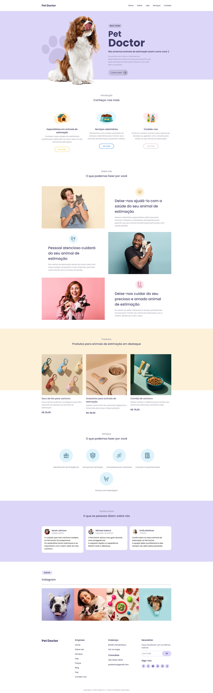

# Pet Doctor



## 🌟 Sobre o projeto

O **Pet Doctor** é uma plataforma dedicada ao cuidado e bem-estar dos animais de estimação. Com um design amigável e acolhedor, o site oferece serviços, produtos e informações úteis para ajudar os donos de pets a cuidar melhor dos seus companheiros. Amamos animais tanto quanto você e queremos garantir que eles tenham uma vida longa, feliz e saudável.

---

## ✨ Funcionalidades principais

- 🐾 **Serviços Veterinários**: Uma ampla gama de serviços para cuidar da saúde dos seus animais de estimação.
- 🛒 **Loja de Produtos para Pets**: Produtos selecionados para atender as necessidades dos seus amigos peludos.
- 📞 **Contato Fácil**: Informações claras para que você possa entrar em contato com a nossa equipe de especialistas.
- 💬 **Testemunhos de Clientes**: Opiniões de clientes que confiam no Pet Doctor.

---

## 📋 Seções do site

- **Introdução**: Conheça mais sobre o Pet Doctor e nossos diferenciais.
- **Produtos**: Destaques de itens úteis para o cuidado dos seus animais, como acessórios, comida e brinquedos.
- **Serviços**: Atendimento emergencial, vacinação, consultas nutricionais, entre outros.
- **Depoimentos**: Comentários de clientes satisfeitos com nossos serviços.
- **Contato**: Localização, telefone e e-mail para agendamento de consultas ou dúvidas.

---

## 📊 Tecnologias utilizadas

O site foi desenvolvido utilizando as seguintes tecnologias para garantir uma experiência moderna e eficiente:

- **HTML**: Estrutura semântica e conteúdo do site.
- **CSS**: Estilização visual, layout e animações para uma interface amigável.
- **JavaScript**: Funcionalidades dinâmicas para melhorar a experiência do usuário.

---

## 🔧 Como rodar o projeto

Siga os passos abaixo para rodar o projeto localmente:

1. **Clone o repositório**:

    ```bash
    git clone https://github.com/seu-usuario/pet-doctor.git
    cd pet-doctor
    ```

2. **Abra o arquivo HTML**:

    Abra o arquivo `index.html` no navegador de sua preferência para visualizar o projeto.

---

Explore todos os recursos do Pet Doctor e garanta o melhor cuidado para o seu animal de estimação! 🐶🐾
